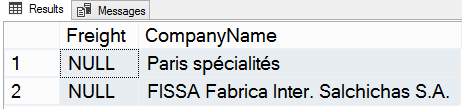
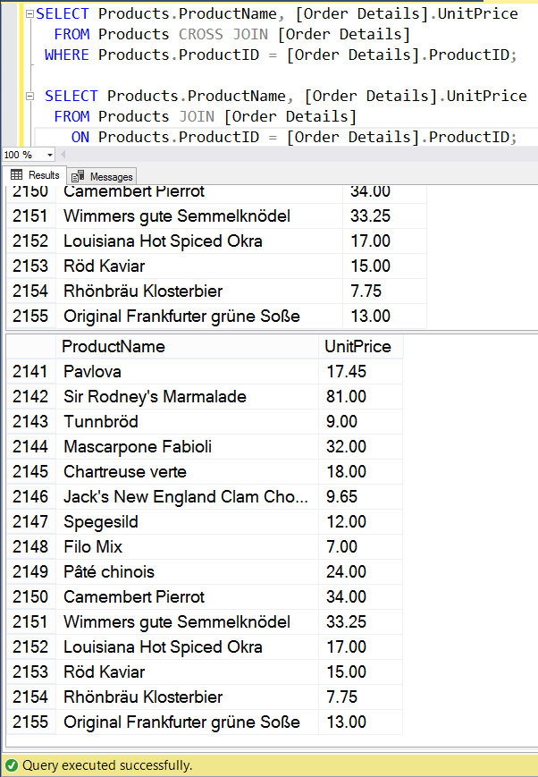

## Практика

##### Задание 1

*Переписать решение к , используя `JOIN`.*

*Текст задания: организовать эквисоединение, которое выводит цену и названия тех товаров, для которых цена за единицу (UnitPrice) в таблице Order Details меньше 20.*

```sql
SELECT Products.ProductName, [Order Details].UnitPrice
  FROM Products JOIN [Order Details]
    ON Products.ProductID = [Order Details].ProductID
 WHERE [Order Details].UnitPrice < 20
 ORDER BY [Order Details].UnitPrice;
```

---

##### Задание 2

*Имеется запрос:*
```SQL
SELECT Orders.Freight, Customers.CompanyName
  FROM Orders INNER JOIN Customers
    ON Orders.CustomerID = Customers.CustomerID
 ORDER BY Freight;
```

*Требуется проверить этот запрос с вариантом `FULL JOIN` -- за счёт чего выдача получилась объёмнее?*

**Ответ**: за счет полей с названиями компаний, от которых не поступал заказ.

Таких компаний две:


---

##### Задание 3

*Как с помощью предложения `WHERE` превратить запрос `CROSS JOIN` в `INNER JOIN`?*

Т.к. операция `INNER JOIN` возвращает пересечение множеств, а `CROSS JOIN` - набор всевозможных комбинаций элементов из этих множеств, с помощью `WHERE` нужно задать условие, по которому будут выбраны только нужные записи. На ум сразу приходят эквисоединения, рассмотренные в .

---

##### Задание 4

*Переписать следующий запрос в `INNER JOIN`*:

```sql
SELECT Products.ProductName, [Order Details].UnitPrice
  FROM Products CROSS JOIN [Order Details]
 WHERE Products.ProductID = [Order Details].ProductID
```

Код решения:
```sql
SELECT Products.ProductName, [Order Details].UnitPrice
  FROM Products JOIN [Order Details]
    ON Products.ProductID = [Order Details].ProductID;
```

Результаты двух запросов идентичны:



---
