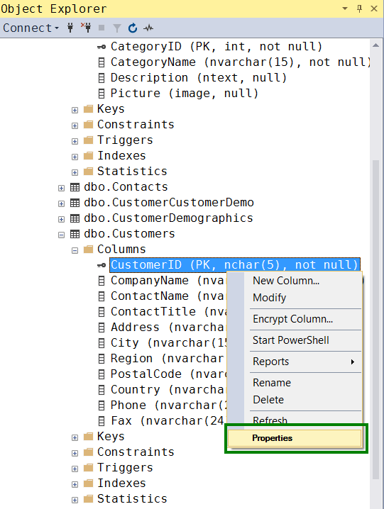
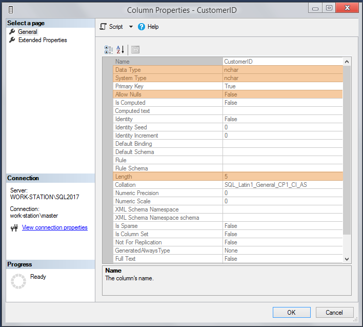

# Команды обновления

Это группа команд, позволяющих *модифицировать содержимое* таблиц.

## INSERT

Команда `INSERT` добавляет в таблицу новую запись

Структура запроса:
```
INSERT INTO table_name (domen_name_1, domen_name_2, ...)
VALUES (value_1, value_2, ...);
```

В списке значений представлены значения полей новой записи, следующие в порядке полей.

После имени таблицы можно дополнительно указать в скобках список названий конкретных полей. Полям, которые не указаны в этом списке, будут присвоены значения по умолчанию.

Пример запроса:
```sql
INSERT INTO Categories (CategoryName, Description) 
VALUES ('Gaz', 'Gaz from Russia');
```

PK в таблице Categories формируется автоматически, поле изображения останется пустым, по умолчанию.

### Потенциальные проблемы INSERT

#### Попытка записи запрещенного типа в PK

Правильно спроектированная база данных в качестве PK (первичных ключей) обычно задействует числовые поля с автоматическим увеличением значения -- как например таблица Orders, где PK OrderID целое число. 

Мы работаем с учебной базой, где в качестве PK таблицы Customers используется уникальный текстовый идентификатор из пяти символов, который создаётся вручную. Попытка выполнения команды
```sql
INSERT INTO Customers (CompanyName, ContactName, Address, City, PostalCode, Country)
VALUES ('GazProm', 'Petya Ivanov', 'Main 33/7 21', ' Piter', '140060', 'Russia');
```

вызовет ошибку
```
Cannot insert the value NULL into column 'CustomerID', 
table 'northwind.dbo.Customers';
column does not allow nulls.
```

Откроем свойства поля CustomerID:


Видно, что в данное поле допустима запись строк длиной не более 5 символов, а NULL - запрещено.



Так как в запросе мы явно не указали поле CustomerID, сервер пытается записать в него значение NULL, что и приводит к ошибке.

Чтобы запрос на вставку новой записи в таблицу Customers отработал нужным образом, нужно придумать и явно добавить корректный уникальный идентификатор (CustomerID -- 'GPPET'):
```sql
INSERT INTO Customers (CustomerID, CompanyName, ContactName, Address, City, PostalCode, Country) 
VALUES ('GPPET', 'GazProm', 'Petya Ivanov', 'Main 33/7 21', ' Piter', '140060', 'Russia');
```

#### Добавление записи без учета связей между таблицами

Команда `INSERT` срабатывает, как мы видим, не всегда. Особый проблемный случай, который необходимо учитывать, связан с тем, что обычно в рабочей базе данных сформировано множество взаимосвязей между таблицами. Добавление новой записи без учета этих связей (попытка ввода неверного FK-ключа) может привести к нарушению ссылочной целостности.

Например, попробуем добавить в табличку территорий Territories новую запись. В этой таблице есть FK-связь с регионом (таблица Region) по полю RegionID, а самих регионов в тестовой базе всего четыре. Мы можем без проблем добавить новую территорию для существующего восточного региона:
```sql
INSERT INTO Territories (TerritoryID, TerritoryDescription, RegionID)
VALUES ('125007', 'Piter', 1);
```

Тут мы вручную указываем PK-ключ, потому что он не генерируется автоматически, а задаёт конкретную территорию по официальному классификатору.

Однако если мы попробуем указать несуществующий FK-ключ 5 на таблицу Region:
```sql
INSERT INTO Territories (TerritoryID, TerritoryDescription, RegionID)
VALUES ('125007', 'Piter', 5);
```

возникнет ошибка
```
The INSERT statement conflicted with the FOREIGN KEY 
constraint "FK_Territories_Region".
```

# Практика

Упражнения по `INSERT` -- [отчет](sql_skillsmart_lesson11_prac.md#практика-ч-1), раздел "Практика, ч. 1".
