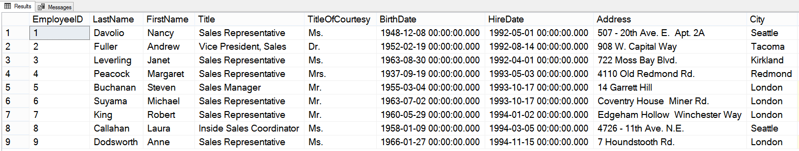
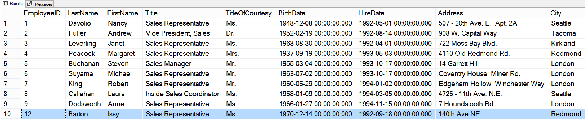
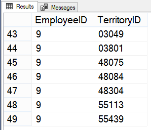
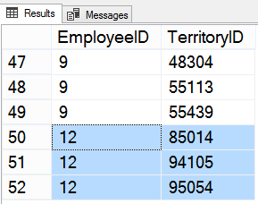
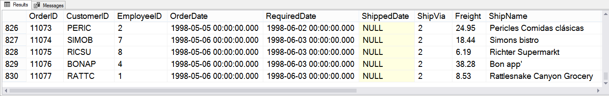
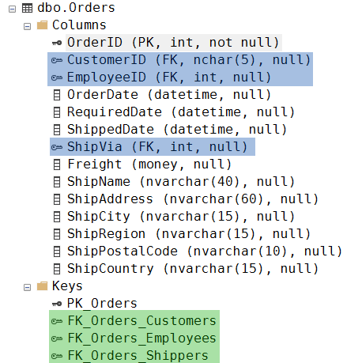
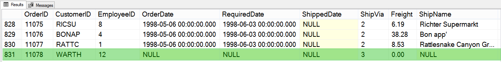

# Практика, ч. 1

##### Задание 1

*Добавьте нового пользователя в таблицу Employees.*

Исходная таблица Employees:



Код запроса:
```sql
INSERT INTO Employees
       ([LastName],
        [FirstName],
        [Title],
        [TitleOfCourtesy],
        [BirthDate],
        [HireDate],
        [Address],
        [City],
        [Region],
        [PostalCode],
        [Country],
        [ReportsTo])
VALUES ('Barton',
        'Issy',
        'Sales Representative',
        'Ms.',
        '1970-12-14 00:00:00.000',
        '1992-09-18 00:00:00.000',
        '140th Ave NE',
        'Redmond',
        'WA',
        '98052',
        'USA',
        2) ;
```

Таблица Employees после выполнения запроса:



---

##### Задание 2

*Связать добавленного пользователя с какой-либо территорией с помощью таблицы EmployeeTerritories (многие-ко-многим).*

Исходная таблица EmployeeTerritories:



Код запроса:
```sql
INSERT INTO EmployeeTerritories (EmployeeID, TerritoryID)
VALUES (12, 95054),
       (12, 85014),
       (12, 94105);
```

Таблица EmployeeTerritories после выполнения запроса:



---

##### Задание 3

*Попробуйте добавить новую запись в таблицу заказов Orders. Возникнут ли какие-либо конфликты?* 

Исходная таблица Orders (фрагмент):



В таблице много полей, через некоторые осуществляется связь с другими таблицами. При составлении запроса нужно:
- вручную указать значения для полей, в которых может возникнуть конфликт со значениями "по умолчанию";
- учесть связи таблиц и в полях FK указать корректные (существующие) идентификаторы.

Определить ключевые поля поможет раздел Columns, а названия таблиц, хранящих корректные значениями ключей - раздел Keys:



Код запроса:
```sql
INSERT INTO Orders (CustomerID, EmployeeID, ShipVia)
VALUES ('WARTH', 12, 3);
```

Поле OrderID не указано, т.к. значение данного идентификатора (PK) создается автоматически.

В таблицу Orders добавлена новая запись:



Хотя конфликтов не возникло, здесь рассмотрен пример опасности прямой модификации таблицы без учёта логической целостности. Мы добавили заказ, в котором не заданы важные поля (например, дата заказа). Товары в этом заказе отсутствуют, так как не сформирована связь в таблице Order Details, и подобные некорректности могут привести к существенному искажению логической структуры.
