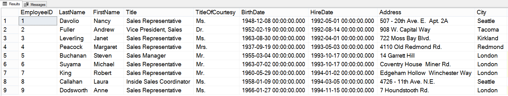
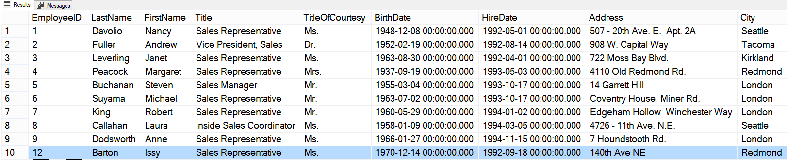
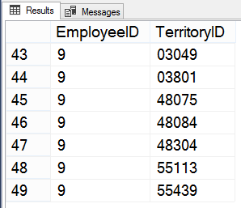
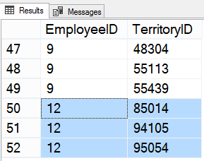
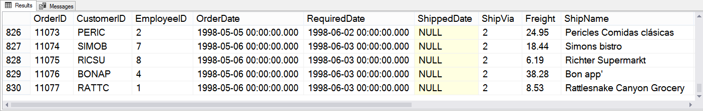
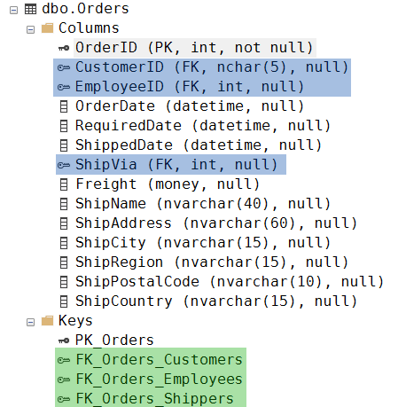
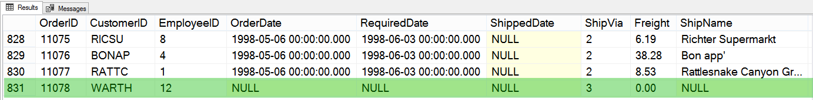
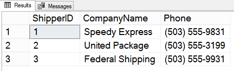
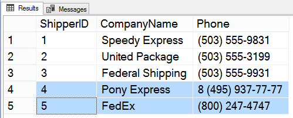

# Практика, ч. 1

##### Задание 1

*Добавьте нового пользователя в таблицу Employees.*

Исходная таблица Employees:



Код запроса:
```sql
INSERT INTO Employees
       ([LastName],
        [FirstName],
        [Title],
        [TitleOfCourtesy],
        [BirthDate],
        [HireDate],
        [Address],
        [City],
        [Region],
        [PostalCode],
        [Country],
        [ReportsTo])
VALUES ('Barton',
        'Issy',
        'Sales Representative',
        'Ms.',
        '1970-12-14 00:00:00.000',
        '1992-09-18 00:00:00.000',
        '140th Ave NE',
        'Redmond',
        'WA',
        '98052',
        'USA',
        2) ;
```

Таблица Employees после выполнения запроса:



---

##### Задание 2

*Связать добавленного пользователя с какой-либо территорией с помощью таблицы EmployeeTerritories (многие-ко-многим).*

Исходная таблица EmployeeTerritories:



Код запроса:
```sql
INSERT INTO EmployeeTerritories (EmployeeID, TerritoryID)
VALUES (12, 95054),
       (12, 85014),
       (12, 94105);
```

Таблица EmployeeTerritories после выполнения запроса:



---

##### Задание 3

*Попробуйте добавить новую запись в таблицу заказов Orders. Возникнут ли какие-либо конфликты?* 

Исходная таблица Orders (фрагмент):



В таблице много полей, через некоторые осуществляется связь с другими таблицами. При составлении запроса нужно:
- вручную указать значения для полей, в которых может возникнуть конфликт со значениями "по умолчанию";
- учесть связи таблиц и в полях FK указать корректные (существующие) идентификаторы.

Определить ключевые поля поможет раздел Columns, а названия таблиц, хранящих корректные значениями ключей - раздел Keys:



Код запроса:
```sql
INSERT INTO Orders (CustomerID, EmployeeID, ShipVia)
VALUES ('WARTH', 12, 3);
```

Поле OrderID не указано, т.к. значение данного идентификатора (PK) создается автоматически.

В таблицу Orders добавлена новая запись:



Хотя конфликтов не возникло, здесь рассмотрен пример опасности прямой модификации таблицы без учёта логической целостности. Мы добавили заказ, в котором не заданы важные поля (например, дата заказа). Товары в этом заказе отсутствуют, так как не сформирована связь в таблице Order Details, и подобные некорректности могут привести к существенному искажению логической структуры.

# Практика, ч. 2

##### Задание 1

*Написать запрос, чтобы увеличить скидку (Discount) в таблице Order Details до 20% (0.20) для тех единиц товара, которых на складе хранится больше 50 (поле Quantity). Запрос не выполнять, чтобы не вносить изменения в таблицу.*

Код запроса, вариант 1:
```sql
UPDATE [Order Details]
   SET Discount = 0.20
 WHERE Quantity > 50;
```

Код запроса, вариант 2:
```sql
UPDATE [OrderDetails]
   SET Discount = 0.20
 WHERE ProductID IN
       (SELECT ProductID IN Products
         WHERE UnitsInStock > 50);
```
##### Задание 2

*Написать запрос, чтобы в таблице Contacts изменить все контактные данные, ранее приходившиеся на Berlin (поле City) и Germany (поле Country), соответственно на Piter и Russia. Запрос не выполнять, чтобы не вносить изменения в таблицу.*

Код запроса:
```sql
UPDATE Contacts
   SET City = "Piter", Country = "Russia"
 WHERE City = "Berlin" OR Country = "Germany";
```

##### Задание 3

*Добавить и затем удалить несколько записей в таблице Shippers. По какому критерию вы удаляли свежие записи?*

Исходная таблица Shippers:



Код запроса на добавление:
```sql
INSERT Shippers (CompanyName, Phone)
VALUES ('Pony Express', '8 (495) 937-77-77'),
       ('FedEx', '(800) 247-4747');
```

Таблица Shippers после добавления записей:



PK в поле ShipperID автоматически увеличивается на 1 при добавлении каждой новой записи. В исходной таблице было всего 3 записи. Вновь добавленные позиции будет удобно удалить, используя проверку значения PK:

```sql
DELETE FROM Shippers
 WHERE ShipperID > 3;
```
