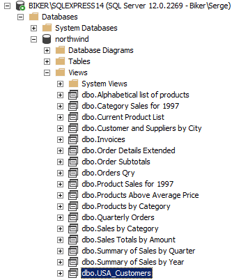
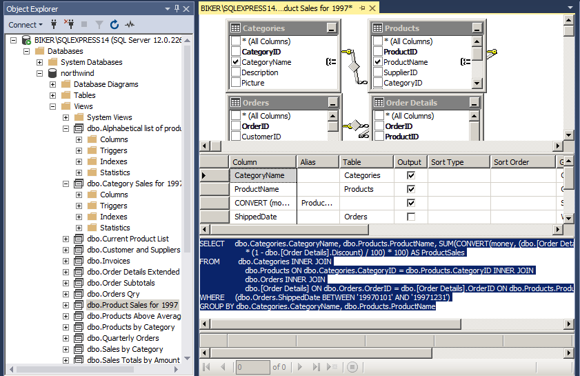

# Представления

 В дополнение к таблицам современные СУБД активно используют так называемые представления.

Представление -- это именованный набор данных, который физически не существует в таблице, а формируется динамически при выполнении запроса SQL. Текст запроса хранится в базе данных, а не в клиентской программе, поэтому с точки зрения пользователя базы данных представление по структуре ничем не отличается от таблицы.

Содержимое представления формируется динамически, выполнением запроса в момент обращения к представлению по имени. Результат работы запроса и становится содержимым представления, передаваемым клиентскому приложению.

В качестве команды выступает, как правило, команда SELECT, а ее результирующий набор считается содержимым представления. Например, команда
```sql
CREATE VIEW USA_Customers AS
SELECT * FROM Customers
 WHERE Country = 'USA';
```

создаст в базе данных преставление, обращение к которому сформирует содержимое таблицы Customers, отфильтрованное по значению страны. Однако физически в базе данных хранится лишь текст этого запроса SQL, хотя название представления доступно наряду с именами таблиц.

Представления, доступные в базе данных, можно увидеть в разделе Views (Представления).



Видно, что в учебной базе уже существует приличный список представлений. Текст, а также визуальную схему каждого из них можно увидеть, вызвав из локального меню конкретного представления команду Design:



# Практика

##### Задание 1

*Чем представление Invoices отличается от таблицы Orders?*

Технически, представление содержит результаты выполнения запроса, адресованному к таблице.
Физически в БД хранится текст запроса, а не таблица.

##### Задание 2

*Что делает представление "CategorySales for 1997"?*

```sql
SELECT CategoryName, SUM(ProductSales) AS CategorySales
  FROM dbo.[Product Sales for 1997]
 GROUP BY CategoryName
```

Представление содержит количество продаж в каждой категории товаров.

##### Задание 3

*Что делает представление "Sales Total by Amount"?*

Производится фильтрация по сумме заказа и дате доставке, выводятся данные о сумме, ID заказа, названии компании-заказчика, дате доставки.

##### Задание 4

*Что делает представление "Products Above Average Price"?*

Выводит список товаров, цена которых превышает среднюю стоимость всех позиций из таблицы Products.

##### Задание 5

*Что делает представление "Summary of Sales by Quarter"?* 

Выводит информацию о стоимости заказов, информация о которых содержится в представлении Order Subtotals, у которых назначена дата доставки.
