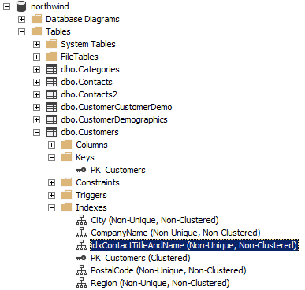

# Работа с базами данных

 Язык SQL позволяет создавать и удалять сами базы данных (наборы таблиц и вспомогательная информация), создавать новые таблицы и изменять структуру существующих.

## Создание новой базы данных

Структура команды создания новой БД:
```sql
CREATE DATABASE имя-базы;
```

В качестве примера создадим тестовую базу TestDatabase:
```sql
CREATE DATABASE TestDatabase; 
```

Выполнение команды завершается успешно, получаем сообщение:
```
Commands completed successfully.
```

TestDatabase появляется в списки после обновления:


## Удаление базы данных

Структура команды полного удаления базы вместе со всем её содержимым:
```sql
DROP DATABASE имя-базы;
```

По понятным причинам будьте крайне осторожны с этой командой.

## Текущая база данных

Когда мы начнём работать с таблицами и запросами, важно определиться, с какой базой данных мы взаимодействуем. По умолчанию например может использоваться база данных Northwind, поэтому в нашем случае необходимо явно указать серверу, что мы переходим к работе с базой данных TestDatabase. Для этого применяется команда
```sql
USE имя-базы-данных;
```

В нашем случае:
```sql
USE TestDatabase;
```

## Работа с таблицами

### Создание таблицы

Пока наша база данных пуста.


Создать новую таблицу можно с помощью команды `CREATE TABLE`:
```sql
CREATE TABLE имя-таблицы (список-описаний-полей);
```

Список описаний полей представляет собой набор пар `имя-поля тип-поля`

Каждая пара отделяется запятой. При необходимости тип поля может дополняться спецификатором длины (для текстовых полей).

Например, мы создадим таблицу Region со структурой, аналогичной таблице Region из базы Northwind:
```sql
CREATE TABLE Region ( 
    RegionID          int       NOT NULL, 
    RegionDescription nchar(50) NOT NULL DEFAULT 'Eastern'
); 
```

Будет сформирована таблица с двумя полями: RegionID типа int (целое) и RegionDescription типа nchar (символьная строка в формате юникода) длиной до 50 символов.

Кроме того, для каждого поля дополнительно указан атрибут NOT NULL, который определяет, что в данном поле не допускаются нулевые (NULL) значения. Точно так же мы можем явно разрешить нулевые поля, указав NULL.

Дополнительно мы можем указать значение для поля по умолчанию с помощью ключевого слова DEFAULT, как это сделано для поля RegionDescription.

После обновления новая таблица появляется в списке:


### Модификация структуры таблицы

Структуру существующей таблицы можно модифицировать.

На данный момент в таблице Region два поля:


Чтобы добавить новые поля, используется команда `ALTER TABLE`:
```sql
ALTER TABLE имя-таблицы ADD имя-поля тип-поля;
```

Например, можно пополнить ранее созданную таблицу Region новыми полями:
```sql
ALTER TABLE Region
  ADD Help nchar(16),
      Temp int; 
```

Новое поле добавляется в конец записи. Исходно его значение для существующих записей считается неопределенным.


Тип поля и значения по умолчанию можно изменить с помощью команды `ALTER COLUMN`:
```SQL
ALTER TABLE Region
ALTER COLUMN Help float NOT NULL;
```

Исходные параметры поля Help:


Параметры поля Help после модификации:


Наконец, используем `DROP` для удаления полей:
```sql
ALTER TABLE Region
 DROP COLUMN Help, Temp;
```

В результате, получаем таблицу, аналогичную созданной ранее.

### Удаление таблицы

Пустую таблицу можно уничтожить.

Команда удаляет заданную таблицу из базы данных при условии, что в ней нет ни одной записи:
```sql
DROP TABLE имя-таблицы
```

**Замечание 1**: в случае необходимости переименовать поля в таблице, Miscrosoft рекомендует удалить ее и построить заново нужным образом.

**Замечание 2**: современные СУБД обычно предлагают весьма удобные графические оболочки, как в нашем случае, где многие вышеперечисленные манипуляции можно выполнять через комфортный графический интерфейс. 

# Ключи и индексы

При создании таблиц особое внимание надо уделить первичному ключевому полю (PK), которое однозначно идентифицирует каждую запись, а также механизмам оптимизации, обеспечивающим ускоренный доступ к записям.

## Уникальные поля и первичные ключи

Ключевое слово UNIQUE, которое ставится после типа поля, накладывает на это поле требование уникальности значений.

**Уникальное поле** -- это поле, в котором все значения в таблице должны быть неповторяющимися.

Уникальные поля часто играют роль первичного ключа. Первичный ключ можно определить в таблице явно с помощью конструкции `PRIMARY KEY`. Эта конструкция, как и `UNIQUE`, требует неповторяемости значений поля. Однако она может быть задана только для одного поля, выбранного в качестве первичного ключа. А ключевое слово `UNIQUE` может использоваться в команде создания таблицы неоднократно.

Например, при создании таблицы Region обязательно надо указать, какое поле будет первичным ключом:
```sql
USE MyTest;
CREATE TABLE Region (
    RegionID int PRIMARY KEY,
    RegionDescription nchar(50) NOT NULL
);
```

*Прим. Синтаксис задания первичного ключа может отличаться в зависимости от диалекта SQL конкретной СУБД.*

Однако если мы теперь попробуем вставить в эту таблицу новую запись, рассчитывая, что RegionID получит какое-то значение по умолчанию:
```sql
INSERT INTO Region (RegionDescription)
VALUES ('12345');
```

то появится ошибка:
```
Cannot insert the value NULL into column 'RegionID', table 'Region'; 
column does not allow nulls.
```

Особенность первичного ключа в том, что он не допускает ни повторяющихся, ни нулевых полей. Однако будет очень неудобно каждый раз вручную указывать какой-то уникальный идентификатор для PK-поля RegionID, особенно если добавляется множество записей.

Практически всеми СУБД поддерживаются так называемые auto-increment поля, значения которых формируются автоматически при добавлении новой записи. Синтаксис описания таких полей обычно отличается в разных системах. В Microsoft SQL Server соответствующему полю надо задать свойство `IDENTITY` с двумя значениями, первое из которых -- начальное, а второе -- шаг приращения. Например:
```sql
CREATE TABLE Region (
    RegionID int IDENTITY(1,3) PRIMARY KEY,
    RegionDescription nchar(50) NOT NULL
);
```

Теперь при добавлении записей в таблицу Region первая автоматически получит в поле RegionID значение 1, вторая -- значение 4, третья -- значение 7, и т. д.  

Подробнее об `IDENTITY` можно почитать [здесь](https://docs.microsoft.com/en-us/sql/t-sql/statements/create-table-transact-sql-identity-property?view=sql-server-ver15#syntax).

Поля FK создаются аналогичным образом, но требуется указывать таблицу, с которой осуществляется связь через `REFERENCES`:
```sql
CREATE TABLE Territories (
    TerritoryID          nvarchar(20),
    TerritoryDescription nchar(16),
    RegionID             int NOT NULL,

    PRIMARY KEY(TerritoryID),
    
    FOREIGN KEY (RegionID)
	    REFERENCES Region(RegionID)
);

```
Как можно заметить, ключевые поле можно назначать отдельно.

Подробнее о FOREIGN KEY Constraints можно почитать [здесь](https://dev.mysql.com/doc/refman/8.0/en/create-table-foreign-keys.html).     
Различные примеры оформления - [здесь](https://learnsql.com/cookbook/how-to-create-a-table-with-a-foreign-key-in-sql/).

### Добавление имен ключам

При определении ключевых полей названия ключей генерируются автоматически. Для удобства чтения, можно воспользоваться оператором `CONSTRAINT` и явно указать название ключа:
```sql
CREATE TABLE Region (
    RegionID int IDENTITY(1,3),
    RegionDescription nchar(50) NOT NULL,
    
    CONSTRAINT PK_Region PRIMARY KEY(RegionID)
);
```

## Создание индексов

**Индексация (индексирование) таблиц** -- это технология, которая существенно (на порядки) ускоряет выборку нужных записей из таблицы. Для этого применяются самые разные алгоритмы, от хэш-таблиц до двоичных деревьев. По значению, например, ключевого поля мы можем очень быстро, буквально единичными операциями добраться до конкретной записи, вместо того чтобы выполнять перебор всей таблицы. Однако индексирование замедляет другие операции -- добавления, модификации и удаления записей. Тем не менее в реляционных системах индексы используются очень активно, и как минимум их надо задавать для первичных ключей, хотя они обычно формируются для PK по умолчанию, автоматически.

Работа с индексами сильно зависит от конкретной СУБД, поэтому и синтаксис соответствующих команд может различаться. Мы рассматриваем в данном разделе диалект SQL для Microsoft SQL Server.

Создание индексов для конкретных полей таблицы выполняется командой `CREATE INDEX`:
```sql
CREATE INDEX имя-индекса ON имя-таблицы (имя-поля)
```

Имя индекса нужно для того, чтобы впоследствии его можно было уничтожить. Существующий индекс удаляют командой DROP:
```sql
DROP INDEX имя-индекса ON имя-таблицы
```

Кроме того, если часто выполняются запросы `SELECT` к неключевым полям, для них тоже очень полезно создать индекс. Более того, некоторые поля могут быть связаны друг с другом логически -- это например ContactTitle и ContactName из таблицы Customers. Если мы постоянно выполняем запросы и фильтрации по этим двум полям одновременно, можно создать единый ключ сразу на два поля -- он будет вычисляться по двойному значению одновременно:
```sql
CREATE INDEX idxContactTitleAndName ON Customers (ContactTitle, ContactName)
```

Подбробнее о создании индексов можно почитать [здесь](https://dev.mysql.com/doc/refman/8.0/en/create-index.html).

## Кластерные индексы



Некоторые индексы в этом примере (для PK-поля) помечены как кластерные. Это означает, что таблица хранится в упорядоченном виде, по значению ключа этого индекса, что дополнительно повышает эффективность её обработки. Если ключевое поле представляет собой автоматически увеличивающийся счётчик, то лучше делать его кластерным.  

Кластерный индекс создаётся следующим образом:
```sql
CREATE CLUSTERED INDEX имя-индекса ON имя-таблицы (имя-поля)
```

Кластерный индекс для таблицы может быть только один.

# Практика

Работа с таблицами -- [Практика, ч. 1](sql_skillsmart_lesson13_prac.md#практика-ч-1).         
Добавление индексов -- [Практика, ч. 2](sql_skillsmart_lesson13_prac.md#практика-ч-2).
