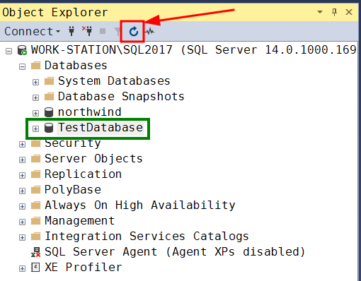
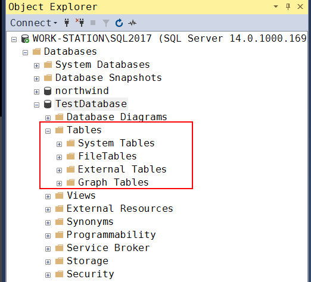
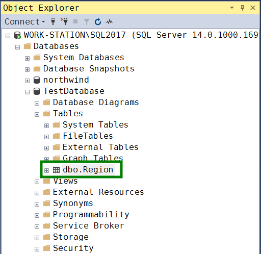

# Работа с базами данных

 Язык SQL позволяет создавать и удалять сами базы данных (наборы таблиц и вспомогательная информация), создавать новые таблицы и изменять структуру существующих.

## Создание новой базы данных

Структура команды создания новой БД:
```sql
CREATE DATABASE имя-базы;
```

В качестве примера создадим тестовую базу TestDatabase:
```sql
CREATE DATABASE TestDatabase; 
```

Выполнение команды завершается успешно, получаем сообщение:
```
Commands completed successfully.
```

TestDatabase появляется в списки после обновления:



## Удаление базы данных

Структура команды полного удаления базы вместе со всем её содержимым:
```sql
DROP DATABASE имя-базы;
```

По понятным причинам будьте крайне осторожны с этой командой.

## Текущая база данных

Когда мы начнём работать с таблицами и запросами, важно определиться, с какой базой данных мы взаимодействуем. По умолчанию например может использоваться база данных Northwind, поэтому в нашем случае необходимо явно указать серверу, что мы переходим к работе с базой данных TestDatabase. Для этого применяется команда
```sql
USE имя-базы-данных;
```

В нашем случае:
```sql
USE TestDatabase;
```

## Работа с таблицами

### Создание таблицы

Пока наша база данных пуста.



Создать новую таблицу можно с помощью команды `CREATE TABLE`:
```sql
CREATE TABLE имя-таблицы (список-описаний-полей);
```

Список описаний полей представляет собой набор пар `имя-поля тип-поля`

Каждая пара отделяется запятой. При необходимости тип поля может дополняться спецификатором длины (для текстовых полей).

Например, мы создадим таблицу Region со структурой, аналогичной таблице Region из базы Northwind:
```sql
CREATE TABLE Region ( 
    RegionID          int       NOT NULL, 
    RegionDescription nchar(50) NOT NULL DEFAULT 'Eastern'
); 
```

Будет сформирована таблица с двумя полями: RegionID типа int (целое) и RegionDescription типа nchar (символьная строка в формате юникода) длиной до 50 символов.

Кроме того, для каждого поля дополнительно указан атрибут NOT NULL, который определяет, что в данном поле не допускаются нулевые (NULL) значения. Точно так же мы можем явно разрешить нулевые поля, указав NULL.

Дополнительно мы можем указать значение для поля по умолчанию с помощью ключевого слова DEFAULT, как это сделано для поля RegionDescription.

После обновления новая таблица появляется в списке:



### Модификация структуры таблицы

Структуру существующей таблицы можно модифицировать.

На данный момент в таблице Region два поля:


Чтобы добавить новые поля, используется команда `ALTER TABLE`:
```sql
ALTER TABLE имя-таблицы ADD имя-поля тип-поля;
```

Например, можно пополнить ранее созданную таблицу Region новыми полями:
```sql
ALTER TABLE Region
  ADD Help nchar(16),
      Temp int; 
```

Новое поле добавляется в конец записи. Исходно его значение для существующих записей считается неопределенным.


Тип поля и значения по умолчанию можно изменить с помощью команды `ALTER COLUMN`:
```SQL
ALTER TABLE Region
ALTER COLUMN Help float NOT NULL;
```

Исходные параметры поля Help:


Параметры поля Help после модификации:


Наконец, используем `DROP` для удаления полей:
```sql
ALTER TABLE Region
 DROP COLUMN Help, Temp;
```

В результате, получаем таблицу, аналогичную созданной ранее.

### Удаление таблицы

Пустую таблицу можно уничтожить.

Команда удаляет заданную таблицу из базы данных при условии, что в ней нет ни одной записи:
```sql
DROP TABLE имя-таблицы
```

**Замечание 1**: в случае необходимости переименовать поля в таблице, Miscrosoft рекомендует удалить ее и построить заново нужным образом.

**Замечание 2**: современные СУБД обычно предлагают весьма удобные графические оболочки, как в нашем случае, где многие вышеперечисленные манипуляции можно выполнять через комфортный графический интерфейс. 


# Практика

*Требуется создать в новой БД TestDatabase таблицу Territories со структурой, аналогичной структуре таблицы Territories из учебной БД Northwind. Добавить в созданные таблицы несколько значений так, чтобы они оказались связаны друг с другом через FK.*

Дополнительно найденная информация:
- параметр `IDENTITY(seed, increment)` в команде `CREATE TABLE` для автоматической генерации значений при добавлении записей -- [статья](https://docs.microsoft.com/en-us/sql/t-sql/statements/create-table-transact-sql-identity-property?view=sql-server-ver15#syntax);
- определение PK и FK, параметр `CONSTRAINT` для создания удобочитаемые названий PK и FK -- [статья](https://learnsql.com/cookbook/how-to-create-a-table-with-a-foreign-key-in-sql/);

Код запроса:
```sql
USE TestDatabase;

CREATE TABLE Region
(
 CONSTRAINT PK_Region PRIMARY KEY (RegionID),
 RegionID          int       NOT NULL IDENTITY(1,1),
 RegionDescription nchar(16)
);

INSERT INTO Region (RegionDescription)
VALUES ('Eastern'),
       ('Western'),
       ('Northern');

CREATE TABLE Territories
(
 CONSTRAINT PK_Territories PRIMARY KEY (TerritoryID),
 CONSTRAINT FK_Territories_Region FOREIGN KEY (RegionID) REFERENCES Region(RegionID)
 TerritoryID          nvarchar(20) NOT NULL,
 TerritoryDescription nchar(16),
 RegionID             int          NOT NULL
);

INSERT INTO Territories (TerritoryID, TerritoryDescription, RegionID)
VALUES ('02116', 'Boston', 1),
       ('60179', 'Hoffman Estates', 2),
       ('03049', 'Hollis', 3);

SELECT * FROM Region;
SELECT * FROM Territories;
```

Результат выполнения запроса:


