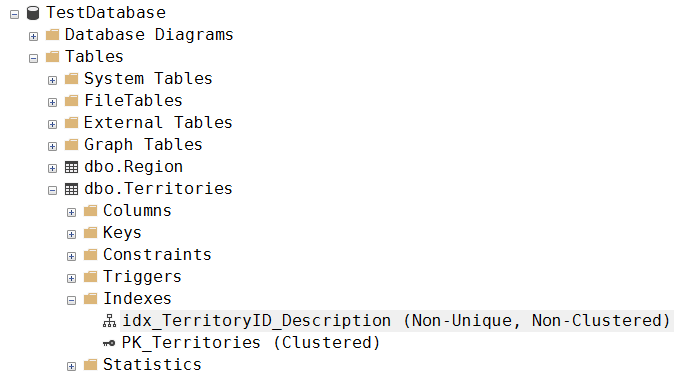

# Практика, ч. 1

*Требуется создать в новой БД TestDatabase таблицу Territories со структурой, аналогичной структуре таблицы Territories из учебной БД Northwind. Добавить в созданные таблицы несколько значений так, чтобы они оказались связаны друг с другом через FK.*

Код запроса:
```sql
USE TestDatabase;

CREATE TABLE Region (
    RegionID          int IDENTITY(1,1),
    RegionDescription nchar(16),
    
	CONSTRAINT PK_Region PRIMARY KEY (RegionID)
);

INSERT INTO Region (RegionDescription)
VALUES ('Eastern'),
       ('Western'),
       ('Northern');

CREATE TABLE Territories (
    TerritoryID          nvarchar(20),
    TerritoryDescription nchar(16),
    RegionID             int NOT NULL

    CONSTRAINT PK_Territories PRIMARY KEY (TerritoryID),
    
	CONSTRAINT FK_Territories_Region FOREIGN KEY (RegionID)
	    REFERENCES Region(RegionID)
);

INSERT INTO Territories (TerritoryID, TerritoryDescription, RegionID)
VALUES ('02116', 'Boston', 1),
       ('60179', 'Hoffman Estates', 2),
       ('03049', 'Hollis', 3);

SELECT * FROM Region;
SELECT * FROM Territories;
```

Результат выполнения запроса:


# Практика, ч. 2

*Добавить подходящие индексы для таблиц тестовой базы, созданной в предыдущем занятии.*

Индекс планируется добавить в таблицу Territories.

Список индексов до выполнения запроса:


Код запроса:
```sql
USE TestDatabase;

CREATE INDEX idx_TerritoryID_Description
    ON Territories(TerritoryID, TerritoryDescription);
```

Список индексов после выполнения запроса:



---
