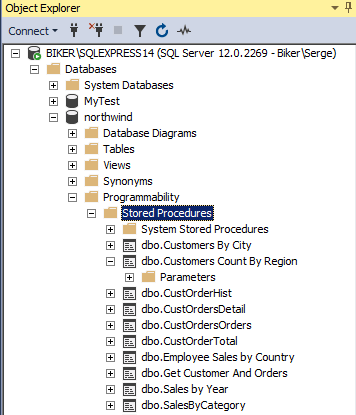
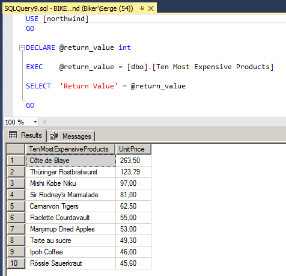
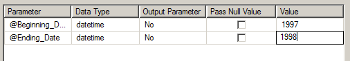
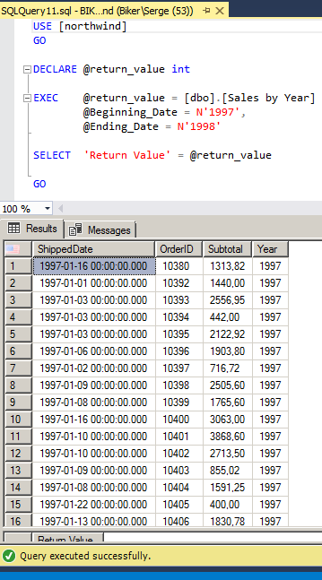

# Простейшая аналитика и хранимые процедуры

Мы изучили стандартный набор возможностей SQL, позволяющий выполнять классическое множество операций **CRUD** (создание Create, чтение Read, модификация Update, удаление Delete) над записями таблиц базы данных, а также дополнительные операции над самими таблицами и над базами данных.

Но прежде всего надо хорошо запомнить, и продолжать практиковаться в навыке отбора записей из базы с помощью SELECT. Недаром иногда говорят, что *SQL -- это оператор SELECT*.

По сути, значительная часть аналитики и удобной отчётности основывается на умении специалиста быстро получать итоговые агрегированные данные (сводки) из множества таблиц в различных срезах и различных группировках.

Например, менеджерам важно получить объёмы продаж по годам или 10 самых накладных в плане расходов товаров. Программист может составить соответствующие SQL-запросы, и каждый раз менять параметры (например, годы) вручную, но такое взаимодействие отдела продаж и ИТ-отдела, очевидно, получится крайне непродуктивным.

На практике SQL-запросы обычно погружаются глубоко в серверную логику (и нередко вообще скрываются от разработчиков через так называемые объектно-распределённые раскладки, ORM). При этом частые запросы от пользователей желательно оформить отдельным кодом, как функции, и вызывать их при необходимости с различными аргументами.

Это можно сделать и серверной логикой, независимо от СУБД, однако нередко различные сложные запросы к множеству таблиц, или связанные с агрегированием, гораздо продуктивнее выполнять ресурсами самой СУБД.

Для этой цели применяются так называемые **хранимые процедуры**: по сути, функции, написанные на SQL, у которых имеются параметры, и которые возвращают нужный результат. Они хранятся и исполняются самой СУБД.
Программирование хранимых процедур -- это отдельная большая и довольно специфичная тема, слабо связанная с CRUD, подразумевающая хорошее знание конкретной марки СУБД и её диалекта SQL.

Рассмотрим простейшие примеры, как работают хранимые процедуры в нашей учебной базе данных Microsoft SQL Server.

Список всех доступных хранимых процедур можно увидеть в разделе Programmability - Stored Procedures.

Выберите процедуру Ten Most Expensive Products (10 наиболее расходных продуктов) -- она не требует параметров. В её локальном меню выберите пункт Execute Stored Procedure... и в открывшемся окне нажмите кнопку OK. Вы увидете в верхнем окне код этой процедуры, а в нижнем -- результат её работы.

Аналогично запустите хранимую процедуру Sales By Year, но она уже запросит значения своих параметров: начальный и конечный годы для формирования сводки. Введите, например, значения 1997 и 1998:

Нажмите ОК, и в результирующую сводку попадут только года 1997 и 1998 (в базе имеются ещё значения для 1996-го года):

Важный дополнительный материал для изучения: [Проблема N+1](https://habr.com/ru/company/otus/blog/529692/) 
