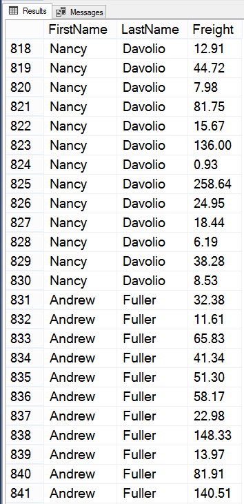
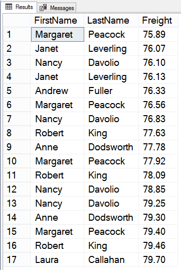

# Конспект

**Соединение таблиц** - [декартово произведение](https://en.wikipedia.org/wiki/Cartesian_product) столбцов, взятых из разных таблиц.

Пример запроса:
```sql
SELECT Employees.FirstName, Employees.LastName, Orders.Freight 
  FROM Employees, Orders;
```

На практике часто приходится выбирать данные из нескольких таблиц, но результат простого соединения зачастую бесполезен - в общем случае, мы полачаем набор всевозможных комбинаций, не обязательно совпадающих по FK-ключам.

Фрагмент огромной выборки, которую вернул запрос:



Обычно из такого набора требуется отобрать только поля, содержащие связанные значения.

**Эквисоединение** - это соединение таблиц, в которых осуществляется проверка равенства значения поля из одной таблицы значению поля в другой.

Термин "эквисоединение" заимствован из реляционной алгебры. 

Чтобы получить эквисоединение таблиц, нужно определить явную связь между таблицами -- добавить в исходный запрос проверку равенства FK-ключей (EmployeeID):
```sql
SELECT Employees.FirstName, Employees.LastName, Orders.Freight 
  FROM Employees, Orders
 WHERE Orders.EmployeeID = Employees.EmployeeID;
```

В результате, мы получаем выборку, состоющую из набора *связанных значений*, взятых *из разных таблиц*. С такими данными уже можно работать. В качестве примера, наложим дополнительное условия по значениям Freight и для удобства:
```sql
SELECT Employees.FirstName, Employees.LastName, Orders.Freight 
  FROM Employees, Orders
 WHERE Orders.EmployeeID = Employees.EmployeeID
   AND Orders.Freight BETWEEN 75 AND 80
 ORDER BY Orders.Freight;
```

Результат выполнения запроса на скриншоте.



---

# Практика

Закрепление теории и ход работы в [отчете](sql_lesson8_prac.md).

---
