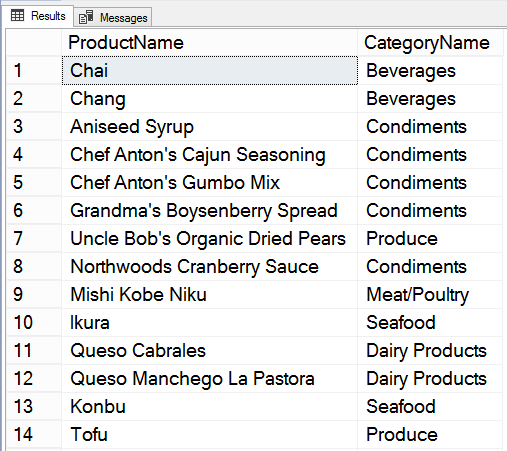
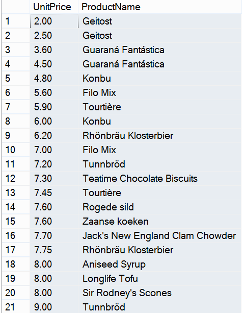
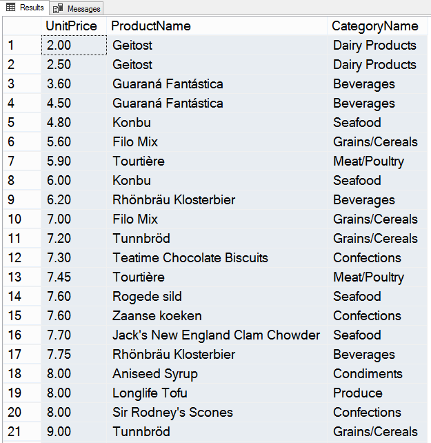

# Практика

---

##### Задание 1

*Сформировать список названий товаров (таблица Products) с указанием для каждого из них соответствующей категории (таблица Categories).*

```sql
SELECT Products.ProductName, Categories.CategoryName
  FROM Products, Categories
 WHERE Products.CategoryID = Categories.CategoryID;
```

Результат выполнения запроса на скриншоте.



---

##### Задание 2

*Организовать эквисоединение, которое выводит цену и названия тех товаров, для которых цена за единицу (UnitPrice) в таблице Order Details меньше 20.*

```sql
SELECT DISTINCT [Order Details].UnitPrice, Products.ProductName 
  FROM Products, [Order Details]
 WHERE [Order Details].UnitPrice < 20
   AND Products.ProductID = [Order Details].ProductID
 ORDER BY [Order Details].UnitPrice;
```

`DISTINCT` добавлено для того, чтобы исключить дублирущиеся пары "цена+название", т.к. таблице [Order Details] одни и те же товары в различных заказах встречаются по нескольку раз. Кроме того, каждый товар может продаваться по различным ценам.

Результат выполнения запроса на скриншоте.



---

##### Задание 3

*Добавить к предыдущему запросу третью таблицу Categories, и выведите в дополнение к названию товара его категорию.*

```sql
SELECT DISTINCT [Order Details].UnitPrice, Products.ProductName, Categories.CategoryName
  FROM Products, [Order Details], Categories
 WHERE [Order Details].UnitPrice < 20
   AND Products.ProductID = [Order Details].ProductID
   AND Products.CategoryID = Categories.CategoryID
 ORDER BY [Order Details].UnitPrice;
```

Результат выполнения запроса на скриншоте.



---
