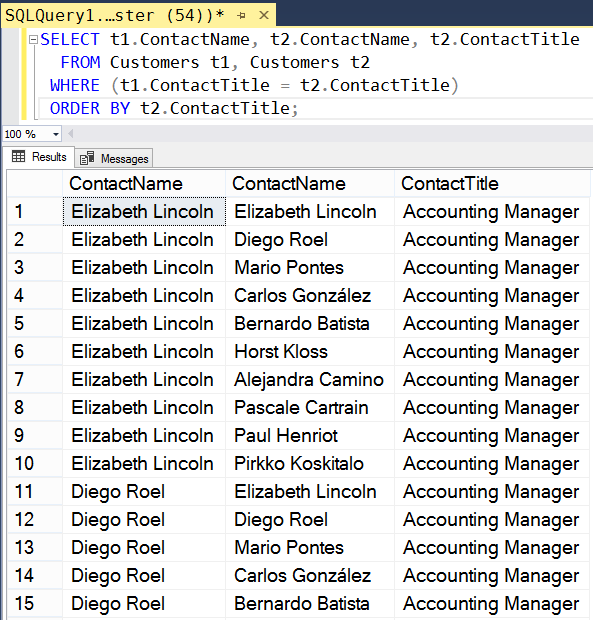

## Идентификаторы и работа с копиями таблицы

Команду SELECT можно применять к нескольким копиям одной и той же таблицы. При этом после ключевого слова FROM имя таблицы записывается несколько раз, причем сопровождается произвольным идентификатором. Он используется для различения копий таблицы в запросе. В качестве префикса полей используют уже не имя таблицы, а эти идентификаторы (так называемые переменные корреляции).

Использование объединения таблицы с нею самой полезно, если в ней надо отыскать связанные элементы. Пусть требуется найти всех заказчиков с одинаковыми контактными должностями (поле ContactTitle). Для этого надо сравнить все записи таблицы -- каждую с каждой. Язык SQL подобные манипуляции над данными (множествами) выполняет автоматически:
```sql
SELECT t1.ContactName, t2.ContactName, t2.ContactTitle 
  FROM Customers t1, Customers t2 
 WHERE (t1.ContactTitle = t2.ContactTitle)
 ORDER BY t2.ContactTitle;
```
Будут выданы все пары контактных лиц, у которых совпадает название должности.



Обычно подобные запросы к копиям таблиц делаются, чтобы выявить в ней различные несогласованности, избыточность информации и т. д.

Переменные корреляции особо важны, если требуется сформировать не просто список результатов, а набор комбинаций, удовлетворяющих заданному условию. Например, для определенной работы требуется сформировать все варианты из трёх сотрудников, проживающих в Лондоне (поле City). В этом поможет следующее выражение:
```sql
SELECT t1.ContactName, t2.ContactName, t3.ContactName, t1.City 
FROM Customers t1, Customers t2, Customers t3 
WHERE (t1.City = 'London') AND (t1.City = t2.City) AND (t1.City = t3.City) 
AND (t1.CustomerID <> t2.CustomerID) AND 
(t1.CustomerID <> t3.CustomerID) AND 
(t2.CustomerID <> t3.CustomerID); 
```

Примечательно, что с помощью операций группировки мы не можем получить такой результат.

---

## Проверка пустого запроса

Предложение EXISTS проверяет, выдает ли подзапрос хотя бы одну запись. Если выдаваемый им набор непустой, предложение EXISTS выдает значение "истина". Фактически это предложение определяет, пуст ли заданный набор. Команду EXISTS можно использовать с логической операцией NOT, если результат проверки требуется инвертировать.

Чаще всего предложение EXISTS применяется в запросах, где требуется сформировать список записей, связанных с другими таблицами. Например, пусть требуется показать все заказы, для которых стоимость товара (таблица Products, поле UnitPrice) больше или равна 200. Для этого лучше всего подходит предложение EXISTS, которое проверит, имеется ли для некоторого заказа непустой список товаров с нужной ценой.
```sql
SELECT * FROM [Order Details] t1 
 WHERE EXISTS (SELECT * FROM Products t2 
                WHERE t1.ProductID = t2.ProductID AND
                      t2.UnitPrice >= 200);
```

Если вместо `EXISTS` мы запишем `NOT EXISTS`, то соответственно получим список товаров, цена которых ниже 200.

---

## Проверка набора на наличие значений вложенным запросом

Предложение `ANY` проверяет, имеется ли в наборе, выданном подзапросом, хотя бы одно из заданных значений. Оно применяется только во вложенных запросах.

Например, требуется отобрать всех сотрудников (таблица Employees), для которых страна заказов (таблица Orders) соответствует их текущей стране.

Для этого надо проверить, какие записи таблицы Employees совпадают по значению поля Country (страна работы) со значением поля ShipCountry (страна поставки) таблицы Orders:
```sql
SELECT t1.FirstName, t1.LastName, t1.Country, t2.OrderDate 
FROM Employees t1, Orders t2 
WHERE t1.Country = ANY 
(SELECT ShipCountry FROM Orders); 
```

Предложение `ALL` противоположно по смыслу предложению `ANY`. Оно проверяет, равно ли заданное значение не какому-то одному, а каждому из значений тестируемого набора записей. Однако работает эта команда не совсем обычно. Выражение наподобие:
```sql
Country = ALL (SELECT ShipCountry FROM Orders)
```
выдаст значение "истина" только в случае, если все значения в столбце ShipCountry одинаковы, а такое маловероятно. Поэтому команда ALL обычно применяется не для проверки равенства, а для проверки неравенства.

Пусть требуется найти все заказы в странах, на которые не приходится ни один сотрудник. Соответствующий запрос можно записать так:
```sql
SELECT t1.FirstName, t1.LastName, t1.Country, t2.OrderDate 
FROM Employees t1, Orders t2 
WHERE t1.Country <> ALL 
(SELECT ShipCountry FROM Orders);
```

Выражение:
```sql
t1.Country <> ALL (SELECT ShipCountry FROM Orders)
```
истинно, если страна сотрудника (поле Country таблицы Employees) не соответствует ни одной из стран-поставщиков (ShipCountry) таблицы заказов.

В учебной базе таких сотрудников нет, но можно вручную временно подкорректировать в таблице Employees страну любого сотрудника, изменив её на произвольное значение, чтобы увидеть результат.

---

### Важно

- `EXISTS` вообще конструкция в целом излишняя в SQL, всегда можно без неё обходиться.
- Построчно работает сама `WHERE` в целом -- сперва конструируется произведение таблиц из `FROM`, потом на него накладывается ограничение` WHERE` -- исключаются записи, для которых предикат `WHERE` ложен.
Что лучше выбрать, это скорее вопрос эффективности: надо смотреть, как в конкретной СУБД реализована та или иная фича, насколько большие получаются промежуточные запросы, и т. п.
- Разница между `ANY` и `IN` на практике по большому счёту лишь в том, что для `ANY` можно использовать операции сравнения `=`,  `>`,  `<` 

---

# Практика

Закрепление теории и ход работы в [отчете](sql_lesson9_prac.md).

---
