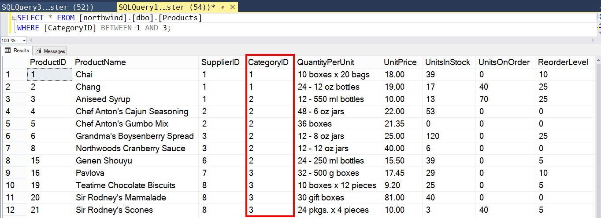
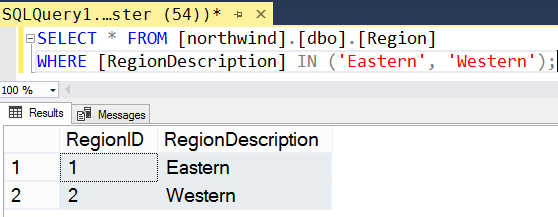
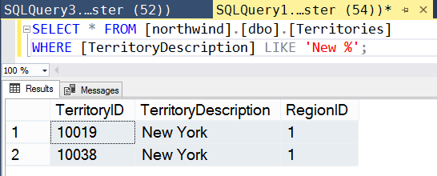

# Конспект

Операторы, расширяющие функционал связки `SELECT - WHERE`:
- `DISTINCT` - избегаем дублирования полей в выводе;
- `BETWEEN` - лежит ли значение в некотором диапазоне;
- `IN` - проверка, входит ли элемент во множество;
- `LIKE`- проверка наличия данной подстроки в другой строке.

Запросы из примеров адресуются к учебной  БД .

---

Если в список полей, добавляемых в результирующий набор, не входит ключевое поле, то в полученном наборе могут встретиться одинаковые записи. Чтобы избежать дублирования, перед списком полей надо поставить ключевое слово `DISTINCT`:
```sql
SELECT DISTINCT <список-полей> FROM <имя-таблицы>;
```
Команда с предикатом `DISTINCT` выдаст результат, из которого удалены дублированные значения.

---

Пример использования `BETWEEN`:
```sql
SELECT * FROM [northwind].[dbo].[Products]
WHERE [CategoryID] BETWEEN 1 AND 3;
```

На скриншоте ниже видно, что граничные значения указанного диапазона также входят в результат запроса.


---

Пример использования `IN`:
```sql
SELECT * FROM [northwind].[dbo].[Region]
WHERE [RegionDescription] IN ('Eastern', 'Western');
```

Результат выполнения запроса на скриншоте.


---

Пример использования `LIKE`:
```sql
SELECT * FROM [northwind].[dbo].[Territories]
WHERE [TerritoryDescription] LIKE 'New %';
```

Результат выполнения запроса на скриншоте.


Если записать часть команды с `LIKE` в виде `<arg1> LIKE <arg2>`, на естественном языке запрос из примера мог бы свучать так: "ВЫБРАТЬ <записи> ИЗ <таблицы> ГДЕ <в столбце arg1> СОДЕРЖИТСЯ <подстрока arg2>"

Символ `%` - это специальный знак, в шаблоне заменяющий подстроку произвольной длины.

В частности, шаблону "New %" соответствуют как строка "New York", так и "New Orleans", "New Year", "New sci-fi movie" и т.д.

Другой спец. знак - `_` (символ подчеркивания). Он обозначает, что в данном месте может находиться любой отдельный символ. 

Если проверяем строку, включающую спец. символы или `/`, в шаблоне перед этими символами нужно добавить слэш, например:
- `'раз_два' LIKE 'раз/_два'`;
-  `'10% годовых' LIKE '10/% годовых'`;
-  `':C/documents/' LIKE '':C//documents//''`.

---

# Практика

Закрепление теории и ход работы в .

---
