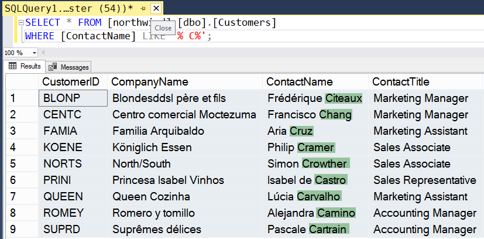
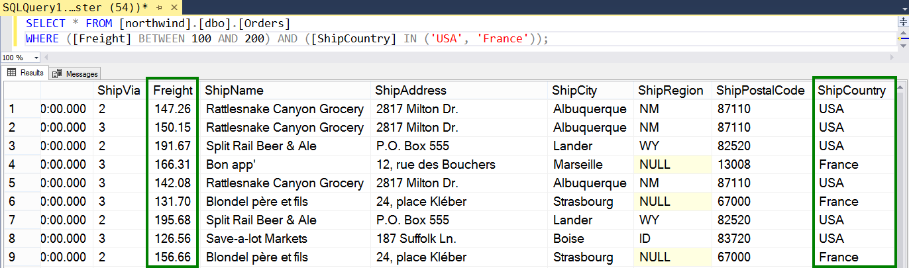
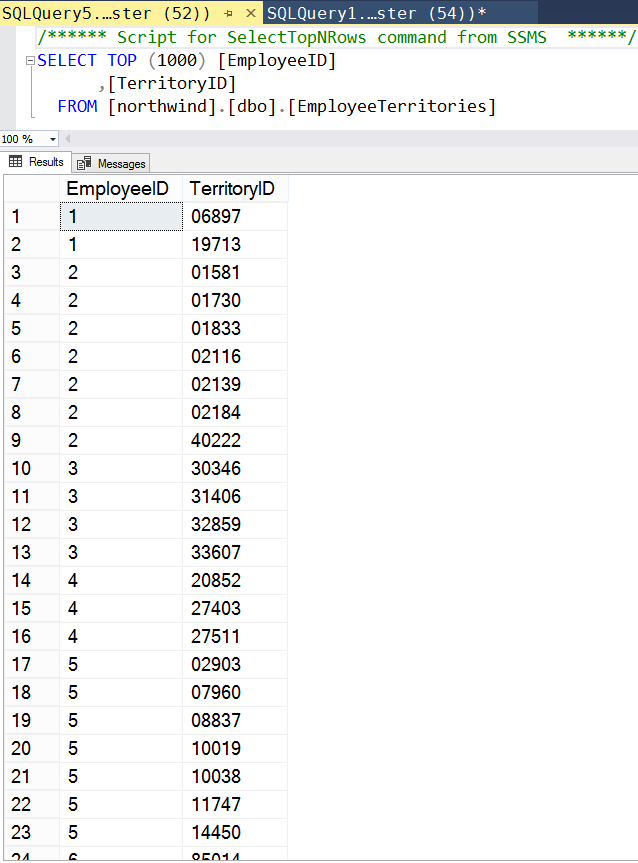
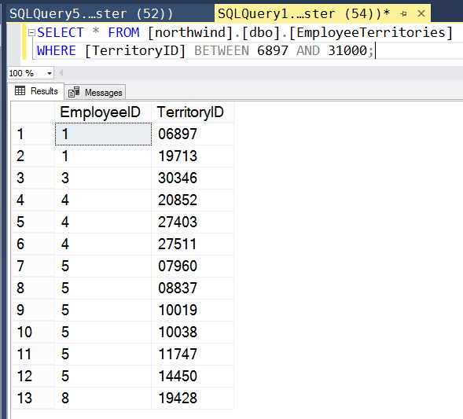

# Практика

---

#### Задание 1

*Найти всех пользователей (Customers), фамилия контактной персоны которых (ContactName) начинается с C.*

Таблица: [northwind].[dbo].[Customers]
Поля: [ContactName]

В поле [ContactName] содержатся строки вида "Имя Фамилия". Для выполнения задания нужно пропускать имя и проверять первый символ второго слова в строке. 

```sql
SELECT * FROM [northwind].[dbo].[Customers]
WHERE [ContactName] LIKE '% C%';
```

Результат выполнения запроса на скриншоте.


---

#### Задание 2

*Найти все заказы, плата за груз у которых (Freight) лежит в диапазоне от 100 до 200, а страна-поставщик ShipCountry -- либо USA, либо France.*

Таблица: [northwind].[dbo].[Orders]
Поля: [Freight], [ShipCountry]

```sql
SELECT * FROM [northwind].[dbo].[Orders]
WHERE ([Freight] BETWEEN 100 AND 200) AND ([ShipCountry] IN ('USA', 'France'));
```

Результат выполнения запроса на скриншоте.


---

#### Задание 3

*Отфильтровать таблицу EmployeeTerritories, задающую отношение многие-ко-многим между сотрудниками и территориальными подразделениями, так, чтобы значение связующего поля TerritoryID находилось в промежутке от 6897 до 31000.*

Таблица: [northwind].[dbo].[EmployeeTerritories]
Поля: [TerritoryID]

```sql
SELECT * FROM [northwind].[dbo].[EmployeeTerritories]
WHERE [TerritoryID] BETWEEN 6897 AND 31000;
```

Вид таблицы до запроса:


Отфильтрованная таблица:


---
