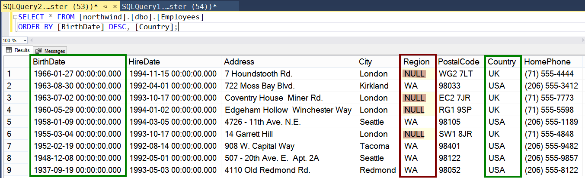
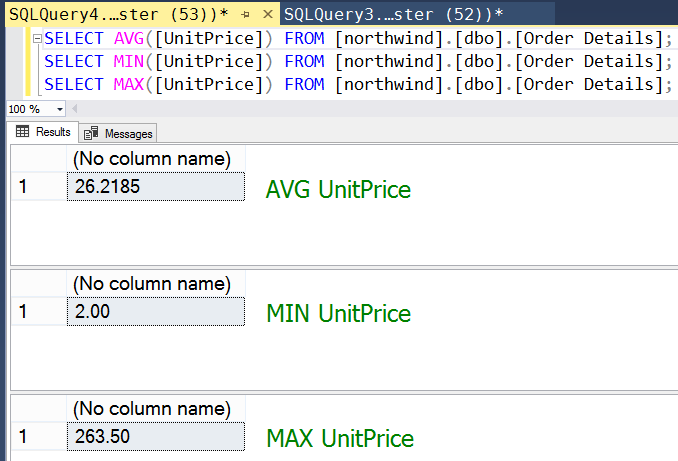
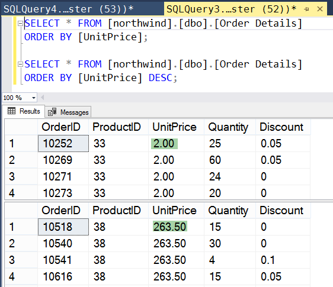
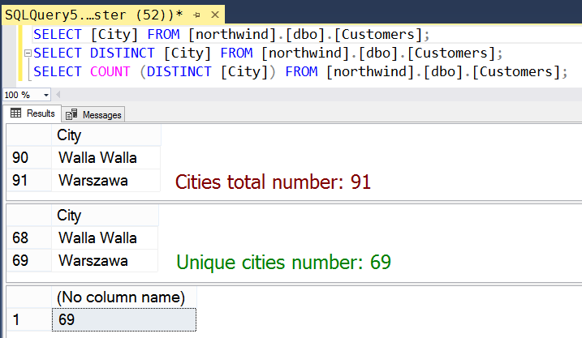

# Практика

Запросы адресованы к учебной  БД .

---

##### Задание 1

*Отсортировать список сотрудников Employees по дате рождения, начиная с самых молодых, и по стране.*

---

Таблица: [northwind].[dbo].[Employees]
Поля: [BirthDate], [Country]

```sql
SELECT * FROM [northwind].[dbo].[Employees]
ORDER BY [BirthDate] DESC, [Country];
```

Результат выполнения запроса на скриншоте.



---

##### Задание 2

*Исключить из предыдущего набора те записи, в которых поле Region равно NULL.*

---

Таблица: [northwind].[dbo].[Employees]
Поля: [BirthDate], [Country], [Region]

```sql
SELECT * FROM [northwind].[dbo].[Employees]
WHERE [Region] IS NOT NULL
ORDER BY [BirthDate] DESC, [Country];
```

Результат выполнения запроса на скриншоте.


---

##### Задание 3

*Найти среднюю, минимальную и максимальную цены по полю UnitPrice из таблицы Order Details.*

---

Таблица: [northwind].[dbo].[Order Details]
Поля: [UnitPrice]

```sql
-- вывести среднюю цену
SELECT AVG([UnitPrice]) FROM [northwind].[dbo].[Order Details];

-- вывести минимальную цену
SELECT MIN([UnitPrice]) FROM [northwind].[dbo].[Order Details];

-- вывести максимальную цену
SELECT MAX([UnitPrice]) FROM [northwind].[dbo].[Order Details];
```

Результат выполнения запроса на скриншоте.



Для проверки обратимся к отстортированной по цене таблицей.



---

##### Задание 4

*Подсчитать количество уникальных городов в списке пользователей (Customers).*

---

Таблица: [northwind].[dbo].[Customers]
Поля: [City]

```sql
SELECT COUNT (DISTINCT [City]) FROM [northwind].[dbo].[Customers];
```

Результат выполнения запроса на скриншоте.



---
