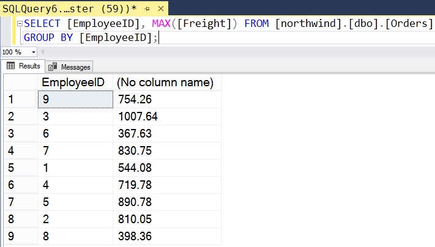
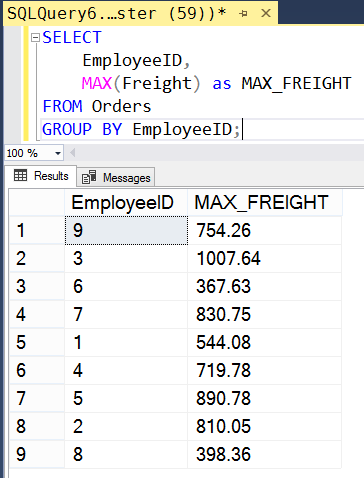

# Конспект

---

## Группировка

 Концепция агрегирования расширяется в SQL средством группировки результатов GROUP BY, которое позволяет сочетать в одном выражении функции и поля. Дополняя запрос именами полей, мы получим в качестве результата уже не одно значение, а набор строк. Функция агрегирования применяется на следующем шаге -- к подмножествам значений, выделяемых для каждого уникального значения поля группировки.

Например, в таблице Orders хранится информация о заказах, и естественно, что подчас одни и те же сотрудники (поле EmployeeID, FK-связь с таблицей Employees) обслуживали одновременно несколько заказов. Мы хотим узнать по каждому из сотрудников, каковы у него были заказы с максимальной платой за груз (Freight). Если мы просто отберём запросом из таблицы эти два поля, то получим набор, где в поле EmployeeID будет множество повторяющихся идентификаторов (ключей), всего 830 записей.
```sql
SELECT EmployeeID, Freight FROM Orders;
```

При этом мы не можем записать
```sql
SELECT EmployeeID, MAX(Freight) FROM Orders;
```
так как пытаемся смешать операции разных типов.

Чтобы такая запись сработала, нам предварительно надо сгруппировать значения по полю EmployeeID, а потом над множеством таких групп (каждая группа характеризуется уникальным EmployeeID) выполнить операцию MAX:
```sql
SELECT EmployeeID, MAX(Freight) 
FROM Orders 
GROUP BY EmployeeID; 
```

Мы получим 9 значений:



Обратите внимание, что столбец с агрегированными значениями не имеет названия. Мы всегда можем изменить имя любого столбца в выдаче с помощью ключевого слова `AS`, которое ставится после любого из элементов в списке полей. Например, мы хотим назвать столбец выдачи максимального значения как MAX_FREIGHT:
```sql
SELECT EmployeeID, 
    MAX(Freight) as MAX_FREIGHT 
FROM Orders 
GROUP BY EmployeeID; 
```



---

## Фильтрация

Так как механизм группировки работает с множествами записей, мы не можем применить к нему стандартное средство условного отбора WHERE, работающее на уровне отдельной записи. В то же время обойтись без предложения WHERE в прикладных задачах сложно -- отбор записей по определенному критерию требуется постоянно. Для того чтобы отобрать семейство сгруппированных записей, используют предложение HAVING.

Например, в нашем случае мы хотим отобрать только тех сотрудников, у которых максимальное значение платы за груз превышает 1000. Делается это так:
```sql
SELECT EmployeeID, 
    MAX(Freight) as MAX_FREIGHT 
FROM Orders 
GROUP BY EmployeeID 
HAVING MAX(Freight) > 1000; 
```

В соответствии со стандартом ANSI SQL мы можем пооптимизировать эту запись вручную -- в частности, разместить обычный фильтр WHERE непосредственно перед операцией группировки:
```sql
SELECT EmployeeID, 
    MAX(Freight) as MAX_FREIGHT 
FROM Orders 
WHERE Freight > 1000
GROUP BY EmployeeID 
HAVING MAX(Freight) > 1000; 
```

Таким образом, мы упрощаем работу весьма нагрузочной операции группировки, которая на вход получит уже минимально необходимый набор данных. Но такой возможностью надо пользоваться с осторожностью. Использовать в WHERE в подобных случаях можно лишь те поля, которые задействованы в операциях агрегирования.

Сгруппированные наборы значений можно упорядочивать с помощью уже изученного предложения ORDER BY. Только в случае операций группировки в качестве сортировки можно указывать лишь те поля, которые явно используются в выборке SELECT.
```sql
SELECT EmployeeID, 
    MAX(Freight) as MAX_FREIGHT 
FROM Orders 
GROUP BY EmployeeID 
ORDER BY MAX_FREIGHT DESC; 
```

---

# Практика

Закрепление теории и ход работы в .

---
