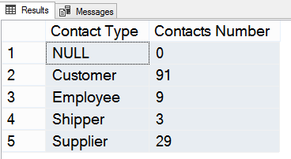
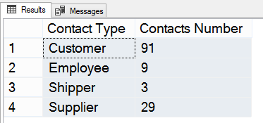
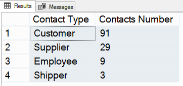
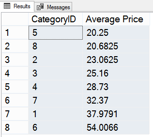
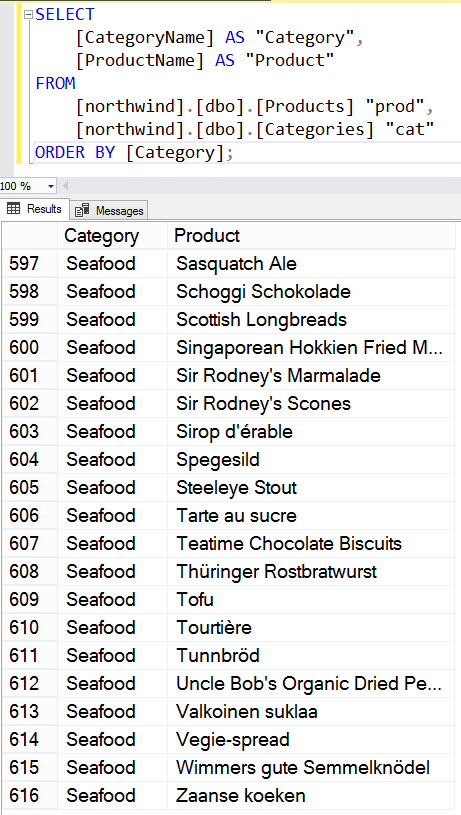
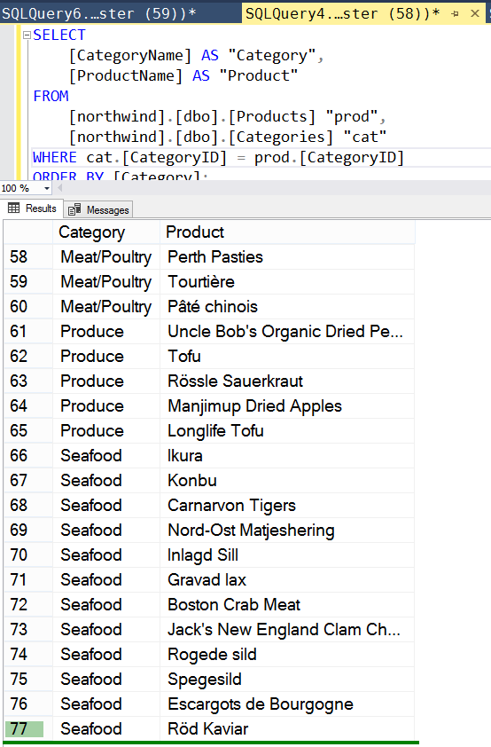
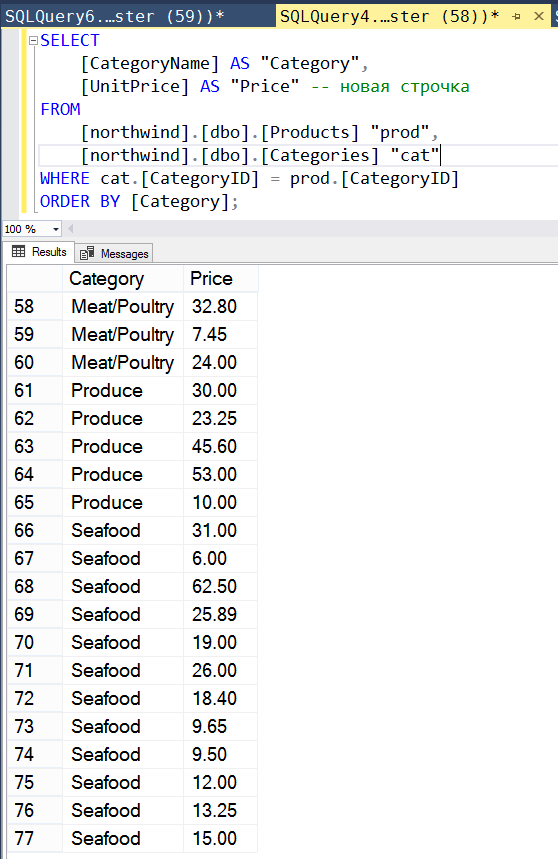
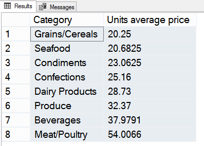

# Практика

Запросы адресованы к учебной  БД .

---

##### Задание 1

*Выполнить агрегацию таблицы Contacts по полю ContactType.*

Таблица Contacts содержит контакты нескольких типов. В соответствии с заданием, возникла идея подсчитать контакты каждого типа.

Результат запроса можно попробовать представить в виде таблицы с двумя столбцами: "Contact Type" и "Contacts Number".

Чтобы подсчитать контакты каждого типа, нужно произвести группировку в столбце ContactType и воспользоваться функцией `COUNT()`.

```sql
SELECT
    /*С помощью AS задаем названия столбцам в выводе*/
    [ContactType] AS "Contact Type",
    COUNT([ContactType]) AS "Contacts Number"
FROM [northwind].[dbo].[Contacts]
GROUP BY [ContactType];
```

Результат выполнения запроса на скриншоте.



Мне не нравится, что в результате запроса присутствует поле с `NULL`. Т.к. у каждого контакта есть определенный тип, данное поле можно не включать в результат запроса.

```sql
SELECT
	[ContactType]  AS "Contact Type",
	COUNT([ContactType]) AS "Contacts Number"
FROM [northwind].[dbo].[Contacts]
WHERE [ContactType] IS NOT NULL -- не добавляем поля со значением NULL в выборку
GROUP BY ContactType;
```

Результат выполнения запроса на скриншоте.



Дополнительно можно отсортировать данные по количеству контактов каждого типа.

```sql
SELECT
	[ContactType]  AS "Contact Type",
	COUNT([ContactType]) AS "Contacts Number"
FROM [northwind].[dbo].[Contacts]
WHERE [ContactType] IS NOT NULL
GROUP BY ContactType
ORDER BY [Contacts Number]; -- используем название столбца, назначенное ранее
```

Результат выполнения запроса на скриншоте.



---

##### Задание 2

*Вывести средние цены товаров (UnitPrice) в каждой из категорий (CategoryID) таблицы Products, отсортированные по возрастанию.*

Что требуется сделать для выполнения задания:
1) сделать выборку значений из столбца CategoryID в таблице Products -- получить "категории товаров";
2) для каждой категории (используем группировку) рассчитать "среднюю цену" по данным из столбца UnitPrice;
3) представить пары "категория товара -- средняя цена" в виде таблицы, где записи отсортированы по возрастанию цены.

```sql
SELECT
    [CategoryID],
    AVG([UnitPrice]) AS "Average Price"
FROM [northwind].[dbo].[Products]
GROUP BY [CategoryID]
ORDER BY [Average Price];
```

Результат выполнения запроса на скриншоте.



---

##### Задание 2, extra

*Вывести среднюю цену товаров (UnitPrice в табл. Products) в каждой категории (CategoryName, табл. Categories), данные отсортировать по возрастанию цены*.

Работаем с записями из 2 таблиц. 

На каждое название категории, CategoryName (табл. Categories), нужно отыскать названия всех товаров,  ProductName (табл. Products), относящихся к данной категории.

Здесь нужно понимать алгоритм извлечения данных из нескольких таблиц в ходе выполнения запроса, о чем узнал из [статьи](https://myrusakov.ru/sql-select-several.html).

Итак, имеются 2 таблицы: Categories и Products. Всего категорий  8, товаров - 77.

Напишем следующий запрос:
```sql
SELECT
    [CategoryName] AS "Category",
    [ProductName] AS "Product"
FROM
    [northwind].[dbo].[Products] "prod",
    [northwind].[dbo].[Categories] "cat"
ORDER BY [Category];
```

Поле CategoryName содержится только в таблице Categories, а ProductName - в таблице Products. В ходе выполнения запроса берется каждая строка в таблице Categories, и поскольку дополнительные условия отбора отсутствуют, в каждую категорию попадут значения ProductName из всех строк таблицы Products. Таким образом, текущий запрос должен вывести таблицу из 8x77=616 (скриншот ниже).



Очевидно, запрос необходимо дополнить условием, чтобы на каждую категорию приходились лишь некоторые товары, так что итоговая таблица должна содержать всего 77 строк.

Т.к. таблицы Categories и Products связаны через ключевое поле (столбец) CategoryID, значения из него и будут использоваться для проверки пренадлежности товара к нужной категории.

```sql
SELECT
    [CategoryName] AS "Category",
    [ProductName] AS "Product"
FROM
    [northwind].[dbo].[Products] "prod",
    [northwind].[dbo].[Categories] "cat"

WHERE cat.[CategoryID] = prod.[CategoryID]

ORDER BY [Category];
```

Если значения CategoryID в строках табл. Categories и табл. Products совпадают, то в к результату запроса добавляется пара CategoryName--ProductName. В противном случае, происходит переход к очередной строке в таблице Products. Т.е. в ходе выполнения запроса каждая строка из одной таблицы проверяется на соответствие каждой строке из другой.

В результате выполнения обновленного запроса получаем список из 77 товаров с названиями категорий.



Возвращаемся к основному заданию: *для каждой категории вывести среднюю цену товаров, данные отсортировать по возрастанию цены*.

Для наглядности, перепишем предыдущий запрос так, чтобы добавить к категориям цену каждого продукта.

```sql
SELECT
    [CategoryName] AS "Category",
    [ProductName] AS "Product",
    [UnitPrice] AS "Price" -- новая строчка
FROM
    [northwind].[dbo].[Products] "prod",
    [northwind].[dbo].[Categories] "cat"

WHERE cat.[CategoryID] = prod.[CategoryID]

ORDER BY [Category];
```

Результат выполнения запроса на скриншоте.



Теперь мы видим цену каждого товара. Кроме того, можно заметить, что данные можно сгруппировать по названию категорий CategoryName. Именно этого и требует задание. Перепишем запрос:

```sql
SELECT
    [CategoryName] AS "Category",
    AVG([UnitPrice]) AS "Units average price"
FROM
    [northwind].[dbo].[Products] "prod",
    [northwind].[dbo].[Categories] "cat"

WHERE cat.[CategoryID] = prod.[CategoryID]

GROUP BY [CategoryName]

ORDER BY [Units average price];
```

Для расчета средней цены сначала производится группировка по названию категорий, после чего для каждой группы рассчитывается функция `AVG()`.

Результат выполнения запроса на скриншоте.



---
