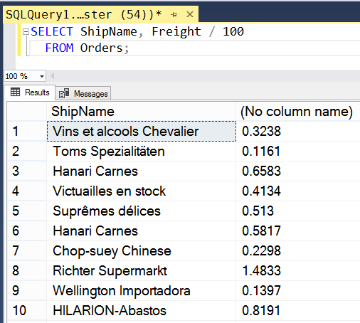

# Конспект

---

## Вычисляемые поля

Запрос SQL может выдавать в результирующий набор не только реально существующие и отфильтрованные поля исходного набора, но и вычисленные "на лету" (столбцы с такими полями называют выходными столбцами).

**Вычисляемое поле** -- это поле результирующего набора записей, значение которого не берется из таблиц базы данных, а вычисляется в соответствии с выражением, заданным в запросе.

Рассмотрим, например, следующий запрос:
```sql
SELECT ShipName, Freight / 100
  FROM Orders;
```

Вторая, выходная колонка результирующей таблицы не соответствует никакому полю исходной таблицы. Она будет содержать значение поля Freight, деленное на 100. В дополнение к вычисляемым полям в выражении SQL можно использовать **текстовые константы**, которые берутся в одинарные кавычки. Они просто вставляются в каждую запись как отдельное поле, например:
```sql
SELECT 'Ship Name:', ShipName,
       'Freight Detail', Freight / 100 
  FROM Orders;
```

Такой формат удобен, если мы хотим передать выходной набор для внешней обработки, и желаем, чтобы в нём существовала наглядная информация по каждому полю.



---

## Вложенные запросы

Запросы разрешено вкладывать друг в друга. В основной запрос передаются результаты предварительных запросов, которые фильтруют значения в таблицах. Выполняется подобная операция одним выражением SQL.

**Вложенный запрос (подзапрос)** -- это запрос, включенный в другой запрос. Результат его работы передается для дальнейшей обработки родительскому запросу.

Пусть требуется узнать, какие заказы приходятся на сотрудника с фамилией King. Напомню, что связь между таблицами осуществляется через FK-ключи. Первым шагом нам надо определить PK (первичный ключ) самого сотрудника в таблице Employees.
```sql
SELECT EmployeeID
  FROM Employees 
 WHERE LastName = 'King';
```

PK будет равен 7.

Теперь нам надо обратиться к таблице Orders и отобрать из неё все записи, в которых EmployeId (FK) равен 7:
```sql
SELECT *
  FROM Orders 
 WHERE EmployeeID = 7; 
```

Мы получим 72 итоговые записи.

Если организовать выдачу запросов из прикладной программы, потребуется два раза соединяться с сервером, два раза отправлять ему команды SQL и два раза дожидаться результата. Однако эти два запроса можно объединить в один. Для этого вместо значения 7 в последнем выражении надо подставить полный текст первого запроса, заключив его в круглые скобки:
```sql
SELECT *
  FROM Orders

 WHERE EmployeeID = (SELECT EmployeeID
                       FROM Employees
                      WHERE LastName = 'King');
```

Мы получим те же 72 записи.

Если значение, возвращаемое вложенным запросом, не единичное, а представляет собой набор, то вместо прямого сравнения в родительском запросе `(EmployeeID = ...)` надо использовать ключевое слово `IN`, синтаксис: `EmployeeID IN набор` (см. задачи 2,3 в отчете).

---

# Практика

Закрепление теории и ход работы в [отчете](sql_lesson7_prac.md).
