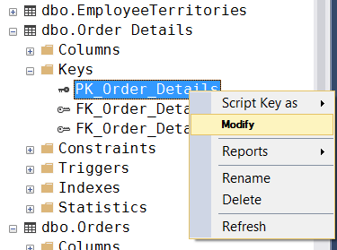
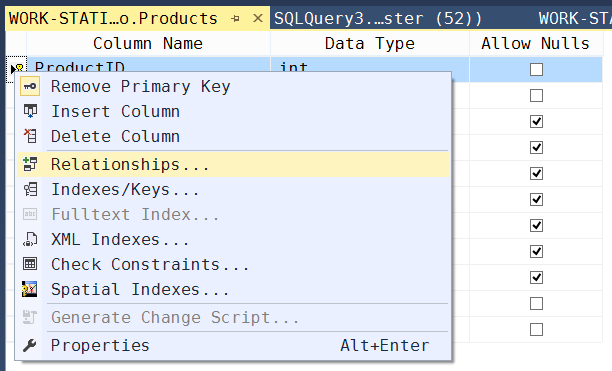
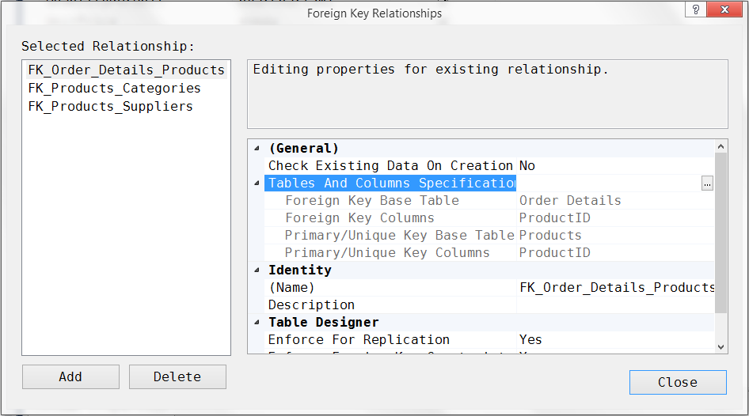

## Отчет по практике

**Задание**: разобраться во взаимосвязях между таблицами БД Northwind и описать их (один-к-одному, один-ко-многим и многие-ко-многим).

### Ход работы

#### Получаем информацию об отношениях






Customers связана с CustomerCustomerDemo
- Private Key Column (Customers) -- CustomerID;
- Foreign Key Column (CustomerCustomerDemo) -- CustomerID.

Тип отношения между таблицам: определить невозможно.

Пояснение: таблица CustomerCustomerDemo не содержит записей

---

Customers связана с Orders:
- Private Key Column (Customers) -- CustomerID;
- Foreign Key Column (связ) -- CustomerID.

Тип отношения между таблицам: "-".

Пояснение: значения (ID в столбце CustomerID) в таблице Customers встречаются строго по 1 разу, а в таблице Orders некоторые значения повторяются.

---

Employees связана с EmployeeTerritories:
- Private Key Column (Employees) -- EmployeeID;
- Foreign Key Column (EmployeeTerritories) -- EmployeeID.

Тип отношения между таблицам: "один ко многим".

Пояснение: значения (ID в столбце EmployeeID) в таблице Employees встречаются строго по 1 разу, а в таблице EmployeeTerritories некоторые значения повторяются.

---

Territories связана с EmployeeTerritories:
- Private Key Column (Territories) -- TerritoryID;
- Foreign Key Column (EmployeeTerritories) -- TerritoryID.

Тип отношения между таблицам: "один к одному".

Пояснение: значения (ID в столбце TerritoryID) в обеих таблицах встречаются строго по 1 разу.

---

Employees связана с Orders:
- Private Key Column (Employees) -- EmployeeID;
- Foreign Key Column (Orders) -- EmployeeID.

Тип отношения между таблицам: "один ко многим".

Пояснение: значения (ID в столбце EmployeeID) в таблице Employees встречаются строго по 1 разу, а в таблице Orders некоторые значения повторяются.

---

Products связана с Categories:
- Private Key Column (Products) -- CategoryID;
- Foreign Key Column (Categories) -- CategoryID.

Тип отношения между таблицам: "один ко многим".

Пояснение: значения (ID в столбце CategoryID) в таблице Products встречаются строго по 1 разу, а в таблице Categories некоторые значения повторяются.

---

Products связана с Suppliers:
- Private Key Column (Products) -- SupplierID;
- Foreign Key Column (Suppliers) -- SupplierID.

Тип отношения между таблицам: "один ко многим".

Пояснение: значения (ID в столбце SupplierID) в таблице Suppliers встречаются строго по 1 разу, а в таблице Products некоторые значения повторяются.

---

Products связана с Order Details:
- Private Key Column (Products) -- ProductID;
- Foreign Key Column (Order Details) -- ProductID.

Тип отношения между таблицам: "один ко многим".

Пояснение: значения (ID в столбце ProductID) в таблице Products встречаются строго по 1 разу, а в таблице Order Details некоторые значения повторяются.

---

Shippers связана с Orders:
- Private Key Column (Shippers) -- ShipperID;
- Foreign Key Column (Orders) -- ShipVia.

Тип отношения между таблицам: "один ко многим".

Пояснение: значения (ID в столбце ShipperID) в таблице Shippers встречаются строго по 1 разу, а в таблице Orders (ID в столбце ShipVia) некоторые значения повторяются.

---

Region связана с Territories:
- Private Key Column (Region) -- RegionID;
- Foreign Key Column (Territories) -- RegionID.

Тип отношения между таблицам: "один ко многим".

Пояснение: значения (ID в столбце RegionID) в таблице Region встречаются строго по 1 разу, а в таблице Territories некоторые значения повторяются.

---

Orders:
- "один ко многим" с Customers (FK_Orders_Customers FKC[CustomerID] PKC[CustomerID]) - один клиент может сделать несколько заказов;

Orders связана с Order Details:
- Private Key Column (Orders) -- OrderID;
- Foreign Key Column (Order Details) -- OrderID.

Тип отношения между таблицам: "один ко многим".

Пояснение: значения (ID в столбце OrderID) в таблице Orders встречаются строго по 1 разу, а в таблице Order Details некоторые значения повторяются.

---

Orders связана с Customers:
- Private Key Column (Orders) -- CustomerID;
- Foreign Key Column (Customers) -- CustomerID.

Тип отношения между таблицам: "один ко многим".

Пояснение: значения (ID в столбце CustomerID) в таблице Orders некоторые значения повторяются, а в таблице Customers встречаются строго по 1 разу.

#### Решение кратко

Categories––Products // "один ко многим"     
Contacts // отношений нет     
Employees––EmployeeTerritories // "один ко многим"     
Employees––Orders // "один ко многим"     
Products––Categories // "один ко многим"     
Products––Suppliers // "один ко многим"     
Products––Order Details // "один ко многим"     
Shippers––Orders // "один ко многим"     
Region––Territories // "один ко многим"     
Territories––EmployeeTerritories // "один ко многим"     
Orders––Order Details // "один ко многим"     
Orders––Customers // "один ко многим"     

### Проверка решения

**Эталонное решение** - таблица связей в БД:

|Таблица 1|Тип связи|Таблица2|Сверил|
|:---:|:---:|:---:|:---:|
|Employees|	многие ко многим<br>(через EmployeeTerritories)	    |Territories|❗|
|Orders|	    многие ко многим<br>(через OrderDetails)	        |Products|❗|
|Customers|	один ко многим	                                |Orders|✔|
|Employees|	один ко многим	                                |Orders|✔|
|Shippers|	один ко многим	                                |Orders|✔|
|Suppliers|	один ко многим	                                |Products|✔|
|Categories|	один ко многим                                  |Products|✔|
|Regions|	    один ко многим                                  |Territories|✔|

---

**Результат проверки**

Employees––EmployeeTerritories // "один ко многим" ❗    
Territories––EmployeeTerritories // "один ко многим" ❗     

Products––Order Details // "один ко многим" ❗    
Orders––Order Details // "один ко многим" ❗     

Employees––Orders // "один ко многим" ✔     
Products––Categories // "один ко многим" ✔    
Products––Suppliers // "один ко многим" ✔    
Shippers––Orders // "один ко многим" ✔    
Orders––Customers // "один ко многим" ✔     
Region––Territories // "один ко многим" ✔     

---

**Рефлексия**

Указал две группы связей:
```
Employees––EmployeeTerritories // "один ко многим"
Territories––EmployeeTerritories // "один ко многим"

Products––Order Details // "один ко многим"
Orders––Order Details // "один ко многим"
```

Не заметил между рассмотренными таблицами отношений: 
```
Employees––Territories // "многие ко многим"

Products––Orders // "многие ко многим"
```

В данный момент, остает открытым вопрос: "Каким образом понять, есть ли отношение многие-ко-многим у двух таблиц, связанных с одной и той же третьей?"
