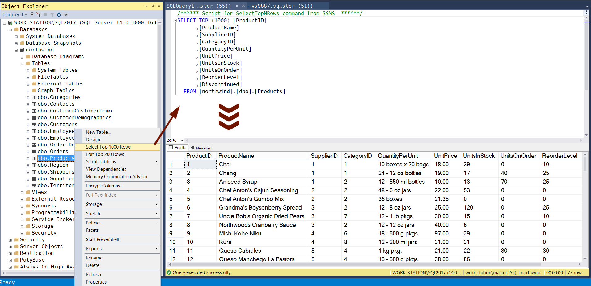

## Отчет по практике

Работаем с учебной БД .

### Ход работы

##### Задание 1

*Написать запрос, формирующий полный список товаров (Products) и выводящий название товара и количество единиц на складе.*

---

Чтобы узнать названия полей, открыл таблицу Products (см. скриншот ниже).

Окно для создания нового запроса открывается с помощью горячих клавиш `Ctrl + N`.

Впервые попробовал написать запрос:
```sql
SELECT ProductName , UnitsInStock FROM Products;
```

Запрос не сработал, я заподозрил ошибку в синтаксисе. Обратил внимание на код, который выводится при выводе полей из контекстного меню для таблиц.



Переписал код запроса в соответствии с примером:
```sql
SELECT [ProductName] , [UnitsInStock] FROM [northwind].[dbo].[Products];
```

При выполнении запроса возвращается таблица вида:

||ProductName|UnitsInStock|
|:---:|:---:|:---:|
|1|Chai|	39|
|2|Chang|	17|
|3|Aniseed Syrup|	13|
|...|...|...|
|77|Original Frankfurter grüne Soße|	32|

---

##### Задание 2

*Написать запрос, формирующий список товаров (Products) и выводящий название товара и цену для тех товаров, которые дешевле 20.*

---

Код запроса:
```sql
/* Вывести также цены товаров, чтобы убедиться в корректности работы запроса */
SELECT [ProductName], [UnitPrice] FROM [northwind].[dbo].[Products]
WHERE [UnitPrice] < 20;
```

##### Задание 3

*Вывести список заказов, у которых плата за груз лежит в диапазоне от 11.7 до 98.1.*

---

Таблица: [northwind].[dbo].[Orders]
Поля: [OrderID], [Freight]

Код запроса:
```sql
/* Вывести также цены, чтобы убедиться в корректности работы запроса */
SELECT * FROM [northwind].[dbo].[Orders] WHERE 11.7 <= [Freight] <= 98.1;
```

Ошибка:
```
Msg 102, Level 15, State 1, Line 2
Incorrect syntax near '<'.
```

Переписал код запроса:
```sql
/* Вывести также цены, чтобы убедиться в корректности работы запроса */
SELECT * FROM [northwind].[dbo].[Orders] WHERE (11.7 <= [Freight]) AND ([Freight] <= 98.1);
```

##### Задание 4

*Отобрать всех сотрудников (Employees) - мужчин (анализируйте поле TitleOfCourtesy).*

---

Таблица: [northwind].[dbo].[Employees]
Поля: [TitleOfCourtesy]

В поле [TitleOfCourtesy] присутствуют следующие обозначения: "Mr.", "Dr.", "Ms.", "Mrs."     
По заданию, нужны все поля, содержащие "Mr.", "Dr."

Код запроса:
```sql
SELECT * FROM [northwind].[dbo].[Employees]
WHERE ([TitleOfCourtesy] == 'Mr.') OR ([TitleOfCourtesy] == 'Dr.');
```

Ошибка:
```
Msg 102, Level 15, State 1, Line 2
Incorrect syntax near '<'.
```

Замена знаков `==` на `=` исправила ситуацию:
```sql
SELECT * FROM [northwind].[dbo].[Employees]
WHERE ([TitleOfCourtesy] = 'Mr.') OR ([TitleOfCourtesy] = 'Dr.');
```

Эксперимент показал, что записи `<>` и `!=` работают одинаково корректно.

##### Задание 5

*Отобрать всех поставщиков (Suppliers) из Японии.*

---

Таблица: [northwind].[dbo].[Suppliers]
Поля: [Country]

Код запроса:
```sql
SELECT * FROM [northwind].[dbo].[Suppliers] WHERE ([Country] = 'Japan');
```

##### Задание 6

*Отобрать все заказы, для которых идентификатор сотрудника-исполнителя равен 2, 4 или 8.*

---

Таблица: [northwind].[dbo].[Orders]
Поля: [EmployeeID]

Код запроса:
```sql
SELECT * FROM [northwind].[dbo].[Orders]
WHERE [EmployeeID] = 2 OR
      [EmployeeID] = 4 OR
      [EmployeeID] = 8;
```

##### Задание 7

*вывести идентификаторы заказов и товаров из таблицы Order Details, для которых цена больше 40, а количество (Quantity) меньше 10.*

---

Таблица: [northwind].[dbo].[Order Details]
Поля: [OrderID], [UnitPrice], [Quantity]

Код запроса:
```sql
/* Вывести также цены и кол-во, чтобы убедиться в корректности работы запроса */
SELECT [OrderID], [UnitPrice], [Quantity] FROM [northwind].[dbo].[Order Details]
WHERE [UnitPrice] > 40 AND [Quantity] < 10;
```
